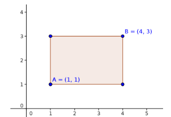

El área de un polígono es la cantidad de superficie que encierran sus lados. El área de un rectángulo es la multiplicación de la base por la altura. ¿Sabes calcularla?

ENTRADA
La entrada consta de una serie de casos de prueba. Cada uno contiene la definición de un rectángulo en una sola línea con cuatro números enteros no negativos menores o iguales que 10.000. Los dos primeros definen la posición del vértice inferior izquierdo del rectángulo y los dos siguientes la del vértice superior derecho.

El último caso de prueba, que no debe procesarse, proporciona un rectángulo en el que el segundo vértice está debajo o a la izquierda del primero.

SALIDA
Para cada caso de prueba se escribirá, en una línea independiente, el área del rectángulo dado.

ENTRADA DE EJEMPLO
1 1 4 3
0 0 1 1
9 7 3 6

SALIDA DE EJEMPLO
6
1
