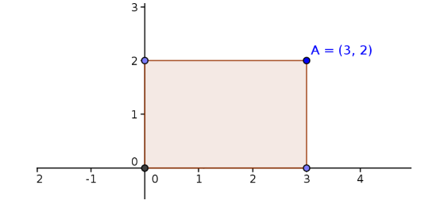

El área de un polígono es la cantidad de superficie que encierran sus lados. El área de un rectángulo es la multiplicación de la base por la altura. ¿Sabes calcularla?

ENTRADA  
La entrada consta de una serie de casos de prueba. Cada uno contiene, en una sola línea, la definición de un rectángulo. Un rectángulo se especifica proporcionando las coordenadas de la esquina superior derecha. Se debe considerar que la esquina inferior izquierda está siempre en el origen de coordenadas, es decir en (0, 0). Se garantiza que la longitud de un lado no superará 10^8.

El último caso de prueba, que no debe procesarse, contendrá un valor negativo en alguno de los ejes.

SALIDA  
Para cada caso de prueba se escribirá, en una línea independiente, el perímetro del rectángulo.

ENTRADA DE EJEMPLO  
3 2  
5 4  
-9 3

SALIDA DE EJEMPLO  
10  
18
